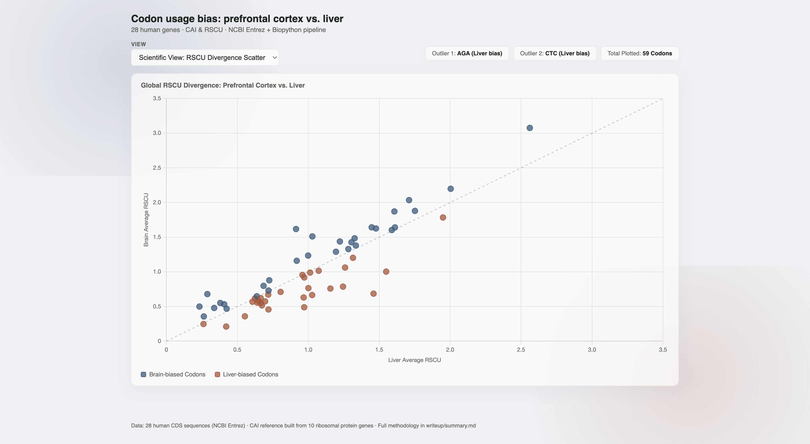

# Codon Usage Bias: Prefrontal Cortex vs. Liver

**[View the Interactive Dashboard](https://paultalat.github.io/codon-bias-brain-liver/dashboard/)**



## Overview

An automated bioinformatics pipeline analyzing tissue-specific synonymous codon usage across 28 human genes. This project investigates whether genes highly expressed in distinct tissues (prefrontal cortex vs. liver) exhibit divergent translational optimization strategies, using the Codon Adaptation Index (CAI) and Relative Synonymous Codon Usage (RSCU).

Full methodology and discussion: [`writeup/summary.md`](writeup/summary.md)

## Methodology

- **Data retrieval:** CDS sequences fetched directly via the NCBI Entrez API (Biopython), with an automated sanity check on every sequence (valid start codon, length divisible by 3, valid stop codon).
- **Reference set:** CAI weights built from scratch from 10 highly-expressed human ribosomal protein genes (RPL3, RPL4, RPL7, RPL8, RPL11, RPL13, RPS2, RPS3, RPS6, RPS9), rather than relying on a precomputed whole-genome table.
- **Verification:** Before running the full pipeline, one gene (GRIN1) was independently checked by hand against a manual codon usage tool (CAIcal) to confirm the automated RSCU calculation was correct.
- **Statistical testing:** Non-parametric Mann-Whitney U tests, with Bonferroni correction applied when testing multiple codons simultaneously.

## Key Findings

- **CAI (translational efficiency):** No statistically significant difference between prefrontal cortex and liver genes (p = 0.765). Gene identity drives optimization more than tissue origin — within-group spread exceeds the between-group difference.
- **RSCU (codon preference):** The largest divergences were in Arginine (AGA, CGG) and Leucine (CTC). AGA and CTC individually cleared the conventional p < 0.05 threshold, but neither survived Bonferroni correction for testing multiple codons (adjusted α = 0.0167) — this pattern is exploratory, not confirmed, at this sample size (n=14/group).

## Project Structure

```
codon-bias-brain-liver/
├── data/           gene lists, raw results, CAI reference weights
├── scripts/        fetch_and_calculate.py, analyze_results.py
├── dashboard/       interactive HTML dashboard
├── writeup/         full methodology and discussion
└── README.md
```

## Reproducibility

```bash
# 1. Clone the repository
git clone https://github.com/paultalat/codon-bias-brain-liver.git
cd codon-bias-brain-liver

# 2. Install dependencies
pip install biopython pandas scipy --break-system-packages

# 3. Fetch NCBI data, build CAI reference, calculate CAI + RSCU
python scripts/fetch_and_calculate.py

# 4. Run statistical analysis (Mann-Whitney, Bonferroni correction)
python scripts/analyze_results.py
```